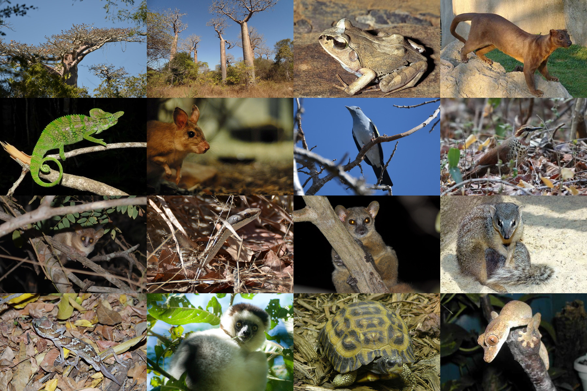
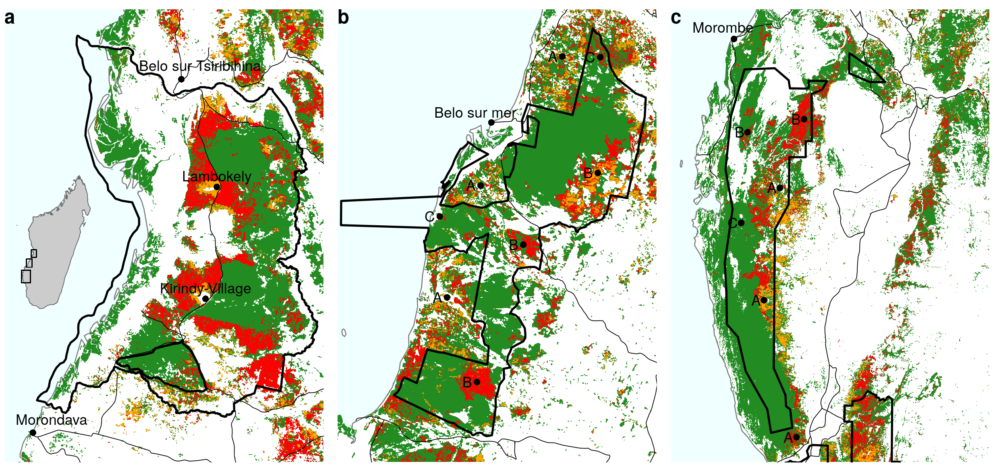
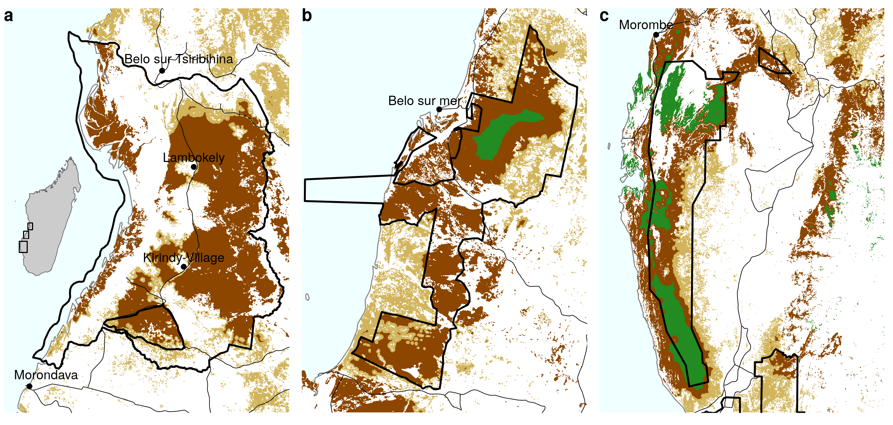

# Figures

(ref:cap-biodiversity) **Emblematic species representative of the biodiversity of the central Menabe**. The dry forest of the central Menabe is home to a very large number of species, many of which being endemic to the region. We present here some examples of this biodiversity for different taxonomic groups: Plants, Birds, Mammals (including Lemurs), Amphibians and Reptiles. From top-left to bottom-right: 1. _Adansonia grandidieri_ (Baillon, 1888), 2. _Adansonia rubrostipa_ (Jumelle & Perrier, 1909), 3. _Aglyptodactylus laticeps_ (Glaw, Vences & Böhme, 1998) 4. _Cryptoprocta ferox_ (Bennett, 1833), 5. _Falco newtoni_ (Gurney, 1863), 6. _Furcifer labordi_ (Grandidier, 1872), 7. _Hypogeomis antimena_ (Grandidier, 1869), 8. _Leptosomus discolor_ (Hermann, 1783), 9. _Mesitornis variegata_ (Geoffroy Saint-Hilaire, 1838), 10. _Microcebus berthae_ (Rasoloarison, Goodman & Ganzhorn, 2000), 11. _Mimophis mahafaliensis_, 12. _Mirza coquereli_ (Grandidier 1867), 13. _Mungotictis decemlineata_ (Grandidier 1867), 14. _Propithecus verreauxi_ (Grandidier, 1867), 15. _Pyxis planicauda_ (Grandidier 1867), 16. _Uroplatus guentheri_ (Mocquard, 1908). Sources: 1,2,5,8,10,11: authors; 3: Miguel Vences; 4,6,7,9,13,14,15,16: Wikipedia; 12: Louise Jasper.

```{r biodiversity, out.width="\\textwidth", fig.cap="(ref:cap-biodiversity)"}

```

(ref:cap-deforestation) **Historical deforestation on the period 2000-2010-2015 in the study areas around Menabe-Antimena New Protected Area (MANAP), Kirindy-Mite National Park (KMNP) and Mikea New Protected Area (MIKEA)**. Madagascar map is represented on the left panel (a), with MANAP study area at the north, KMNP study area in the middle, and MIKEA study area at the south (black rectangles). On each of the panels, the boundaries of the protected areas are represented with black polygones (source: Rebioma, <http://rebioma.net>). Main roads are represented with thin black lines (source: FTM BD500). Coast line is represented with a thin grey line. Morondava and Belo-sur-Tsiribihina are the main cities located near MANAP. Belo-sur-Mer is the main village located near KMNP. Morombe is the main village located near MIKEA. The dashed lines on b) and c) show the trajectories of the cylones _"Fanele"_ (January 2009) and _"Haruna"_ (February 2013), respectively (source: JTWC, <https://www.metoc.navy.mil/jtwc>). Green: forest cover in 2015, orange: 2000-2010 deforestation, red: 2010-2015 deforestation [@Vieilledent2018data]. In the study areas, the main causes of deforestation are: (A) slash-and-burn agriculture (_"hatsake"_) for maize and peanut crops, (B) cyclones followed by uncontrolled fires, and (C) illegal logging. 

```{r deforestation, out.width="\\textwidth", fig.cap="(ref:cap-deforestation)"}

```

(ref:cap-causes) **Main causes of deforestation in central Menabe.** **a-a'**: _Slash-and-burn agriculture (_"hatsake"_) for peanut crop._ Peanut (a') is cultivated as a cash crop. Part of the production is at the destination of the national market but most of it is exported outside Madagascar, mainly for the Chinese market. **b-b'**: _Slash-and-burn agriculture for maize crop._ Maize (b') is cultivated for auto-consumption and as a cash crop. The production of maize is at the destination of the national market and is used in particular to brew the national beers. **c-c'**: _Cyclone followed by uncontrolled fires._ Cyclone _"Fanele"_ (2009) caused tree mortality and accumulation of wood fuel on the ground. As a consequence, uncontrolled fires set on nearby pastures (c') spread over large areas of forest after 2009. **d-d'**: _Illegal logging._ Timbers are used for house and dugout canoe construction.

```{r causes, out.width="\\textwidth", fig.cap="(ref:cap-causes)"}
knitr::include_graphics("figures/causes.png")
```

(ref:cap-scenarios) **Projected deforestation on the period 2010-2050**. Green: projected forest cover in 2050, light brown: 2010-2050 deforestation following conservative scenario S1 (projecting 1990--2010 mean annual deforestation), dark brown: 2010--2050 additional deforestation following scenario S2 (projecting 2000-2015 mean annual deforestation). Most of the 2010--2015 deforestation observed on Fig. 2 is included in the 2010--2050 projections. We predicted a loss of 36--67% of the forest cover in 2050 compared to 2000 depending on the scenario. Most of the remaining forest will be concentrated inside protected areas.

```{r scenarios, out.width="\\textwidth", fig.cap="(ref:cap-scenarios)"}

```

\newpage