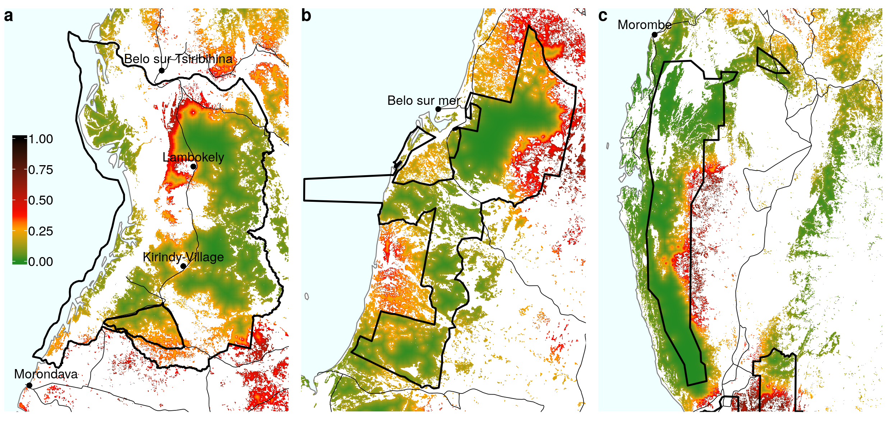

# Appendices

## Appendix 1: Spatial probability of deforestation.

(ref:cap-probability) **Spatial probability of deforestation for the year 2010**. Source: <https:/bioscenemada.cirad.fr/forestmaps>. The spatial probability of deforestation is modelled as a function of the altitude, the distance to forest edge, the distance to main town, the distance to main road, the protected areas, and the distance to past deforestation. These variables describe the accessibility, the land policy and the historical deforestation. The deforestation model also includes spatial random effects at the regional scale to account for the residual variability in the deforestation process which is not explained by the environmental variables (see <https://ghislainv.github.io/forestatrisk> for more details on model specifications).

```{r probability, out.width="\\textwidth", fig.cap="(ref:cap-probability)"}

```

## Appendix 2: _Fanele_ and _Haruna_ cyclones.

(ref:cap-cyclones) **Satellite images and trajectories of cyclones _Fanele_ and _Haruna_ over Madagascar**. **a-b**: Cyclone _Fanele_ in January 2009. **a'-b'**: Cyclone _Haruna_ in February 2013. **a-a'**: MODIS satellite image of the cyclone near peak intensity. **b-b'**: Track and intensity of the cyclone, according to the Saffir-Simpson scale. Highest winds for _Fanele_: 10--min sustained $=$ 185 km/h, 1--min sustained $=$ 215 km/h, gusts $=$ 260 km/h. Highest winds for _Haruna_: 10--min sustained $=$ 150 km/h, 1--min sustained $=$ 195 km/h, gusts $=$ not available. Source: Wikipedia, <https://en.wikipedia.org/wiki/Cyclone_Fanele>, <https://en.wikipedia.org/wiki/Cyclone_Haruna>.

```{r cyclones, out.width="\\textwidth", fig.cap="(ref:cap-cyclones)"}
knitr::include_graphics("figures/cyclones.png")
```


\newpage