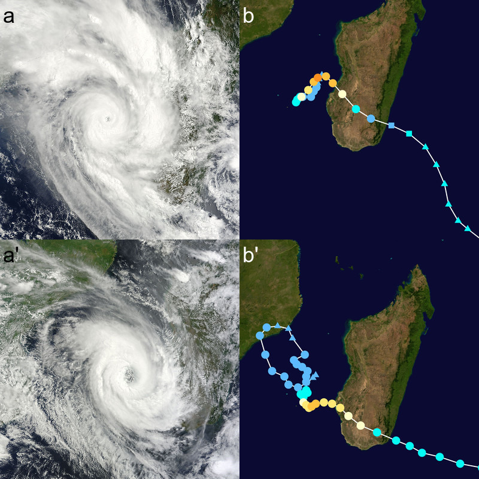

# Appendices

## Appendix 1: Spatial probability of deforestation.

```{r probability, out.width="\\textwidth"}
knitr::include_graphics("figures/probability.png")
```

Figure A1: **Spatial probability of deforestation for the year 2010**. Source: <https:/bioscenemada.cirad.fr/forestmaps>. The spatial probability of deforestation is modelled as a function of the altitude, the distance to forest edge, the distance to main town, the distance to main road, the protected areas, and the distance to past deforestation. These variables describe the accessibility, the land policy and the historical deforestation. The deforestation model also includes spatial random effects at the regional scale to account for the residual variability in the deforestation process which is not explained by the environmental variables (see <https://ghislainv.github.io/forestatrisk> for more details on model specifications).

\newpage

## Appendix 2: _Fanele_ and _Haruna_ cyclones.

```{r cyclones, out.width="\\textwidth"}

```

Figure A2: **Satellite images and trajectories of cyclones _Fanele_ and _Haruna_ over Madagascar**. **a-b**: Cyclone _Fanele_ in January 2009. **a'-b'**: Cyclone _Haruna_ in February 2013. **a-a'**: MODIS satellite image of the cyclone near peak intensity. **b-b'**: Track and intensity of the cyclone, according to the Saffir-Simpson scale. Highest winds for _Fanele_: 10--min sustained $=$ 185 km/h, 1--min sustained $=$ 215 km/h, gusts $=$ 260 km/h. Highest winds for _Haruna_: 10--min sustained $=$ 150 km/h, 1--min sustained $=$ 195 km/h, gusts $=$ not available. Source: Wikipedia, <https://en.wikipedia.org/wiki/Cyclone_Fanele>, <https://en.wikipedia.org/wiki/Cyclone_Haruna>.

\newpage

## Appendix 3: Maize and beer consumption in Madagascar.

Three Horses Beer (better known locally as THB) has been brewed by Star Breweries of Madagascar since 1958. It is the highest selling beer in Madagascar and has been described as emblematic of the country. THB is sold nationwide and since 2005 has been exported to such markets as France, Reunion Island, Comoros and Mayotte. THB Pilsener, the most common variant of THB, is produced from mostly local barley, corn and hops. The mash is a blend of malt (sprouted barley) and corn in an 80/20 ratio to which water and hops are added. In 2006, the Star Brewery was producing 700,000 hectoliters (hL) of beer annually. Star Breweries invested over four million euros into improving its factories in the 2009--2011 period, resulting in a 20% increase in production capacity (source: Wikipedia, <https://en.wikipedia.org/wiki/Three_Horses_Beer>). As a consequence, we can assume that about 840,000 hL of THB Pilsener have been produced each year since 2011.

We assumed that about 1.25 kg of grain is needed to produce 1 kg of malt, and about 20 kg of malt are needed to produce 1 hL of beer [@Kreisz2009]. For a total of 840,000 hL of beer, 1.25 $\times$ 20 $\times$ 840,000 $/$ 1000 $=$ 21,000 tonnes (T) of grain are needed. Because the mash for the THB Pilsener is a blend of malt and corn in an 80/20 ratio, about 4,200 T of maize grain are necessary to produce the annual 840,000 hL of beer.

Given the 2005--2015 average yield of 1.6 T/ha for maize crop in Madagascar (Tab. \@ref(tab:faostat)), about 2,471 ha of maize crop are necessary to produce the local beer. This number is very small compared to the 249,186 ha of maize harvested at the national level (Tab. \@ref(tab:faostat)). 

\newpage