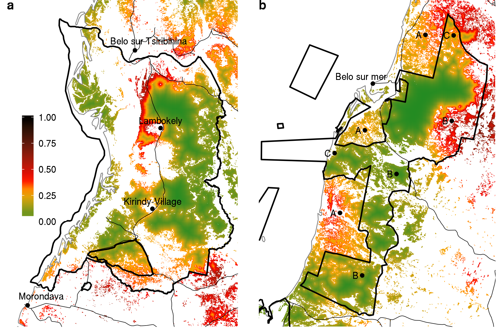

```{r load_data}
load("menabe.rda")
```

#### Ghislain Vieilledent<sup>*,1,2</sup>, Clovis Grinand<sup>3</sup>, Miguel Pedrono<sup>2</sup>, Tsiky Rabetrano<sup>4</sup>, Jean-Roger Rakotoarijaona<sup>5</sup>, Bruno Rakotoarivelo<sup>5</sup>, Fety A. Rakotomalala<sup>3</sup>, Linjanantenaina Rakotomalala<sup>6</sup>, Andriamandimbisoa Razafimpahanana<sup>4</sup> and Frédéric Achard<sup>1</sup>

(*) /Email: ghislain.vieilledent@cirad.fr, /Phone: +39.329.457.2273

1. Joint Research Center of the European Commission, Bio-economy Unit (JRC.D.1), I-21027 Ispra (VA), ITALY
2. Cirad, UPR Forêts et Sociétés, F-34398 Montpellier, FRANCE
3. ETC Terra, F-75016 Paris, FRANCE
4. Wildlife Conservation Society, 101 Antananarivo, MADAGASCAR
5. Office National de l'Environnement, 101 Antananarivo, MADAGASCAR
6. ESSA-Forêts, 101 Antananarivo, MADAGASCAR

## Summary

1. Madagascar is recognized for both its unparalleled biodiversity, concentrated mainly in tropical forests, and its high level of threat which is associated in particular to deforestation. Madagascar population, which is rapidly increasing, is one of the poorest in the world and people rely strongly on forests for their livelihood. Since the end of the colonization (in 1960), much effort has been done to fight poverty and curb deforestation through implementing large development and conservation programs. Despite this, Madagascar remains in the top countries with the highest deforestation rates and the forest cover, particularly in the western dry ecoregion, is rapidly decreasing. 

3. To try to explain why it is so difficult to stop deforestation in Madagascar, we analysed further the deforestation process in two dry forest areas in the central Menabe (western Madagascar) around two protected areas with high biodiversity, the Kirindy-Mitea national park and the Menabe-Antimena new protected area. We derived historical deforestation maps for these two areas from Landsat satellite images on the periods 1990-2000-2010-2014. We validated these maps and identified the main causes of deforestation with field verification points and through household and stakeholder surveys. We then established a map of the future deforestation on the period 2010-2050 assuming a business-as-usual scenario.

4. We showed that deforestation had recently increased in the two study areas, with a deforestation rate of about 2.35%.yr<sup>-1</sup> on the period 2010-2014 compared to 0.85%.yr<sup>-1</sup> on the period 2000-2010. We identified two major causes of deforestation, the first one being illegal slash-and-burn agriculture for the cultivation of peanut and maize as cash crops, the second one being uncontrolled forest fires after cyclonic events. These fires are set by farmers in nearby grasslands to obtain flush of green pasture for livestock. Agents from institutions in charge of the management of the protected areas do not have the means to enforce law against deforestation. Slash-and-burn agriculture intensified recently due to the settlement or migrants following climate-induced famines in southern Madagascar. Money earned by farmers from peanut and maize productions is used to invest into zebu cows. Peanut production is exported outside Madagascar and a large part of the maize production is used to brew the national beers. These activities benefit to several intermediaries, some of who having political responsibilities, which underlies a conflict of interest in the application of the law against deforestation. 

5. _Conclusions:_ In the absence of an efficient strategy to stop deforestation, we predict that half of the forest present in 2000 will have disappeared in 2050. Forest loss, apart from biodiversity loss and climate-change global issues, will be at the expense of local population. Contrary to what is commonly accepted, deforestation in western Madagascar is not associated to agriculture for auto-consumption. International pressure should be put on the Malagasy government to enforce the environmental law and on international companies to not used deforestation-derived agricultural commodities. Of course, these measures must be accompanied by incentive measures towards population to stop deforestation (through agricultural development programs for example) but a large part of the environmental aid should aim at improving governance and controlling trade.

**Keywords**: biodiversity conservation, protected areas, Madagascar, deforestation causes, illegal logging, slash-and-burn agriculture, cyclones, fires, demographic growth.

**Potential journals** (2015 IF): Conservation Letters (7.126), Conservation Biology (4.257), Environmental Research Letters (4.134), Biological Conservation (3.985), Landscape Ecology (3.657), Ambio (2.555), Environmental Conservation (2.235), Biotropica (1.944), Tropical Conservation Science (1.55).

## 1. Introduction

Tropical forests provide important ecosystem services at the global scale, such as biodiversity conservation and climate regulation [@Costanza1997] but also many at the regional scale for local populations. At the local scale, tropical forests supply clean water, can preserve populations from flood [@Bradshaw2007] and provide wood for construction and fuel and other non-woody products for food and health. On the island of Madagascar, three types of tropical forests, covering about 9 millions of hectares (15% of the country area) can be found: the moist forest in the East, the dry forest in the West and the spiny forest in the South [@Vieilledent2016]. Among all the ecosystem services cited previously, Malagasy forests are particularly important for the unique biodiversity they shelter, both in term of number of species and endemism in many taxonomic groups [@Goodman2005]. A large part of the original tropical forest is thought to have disappeared since the arrival of the humans on the island around 2000 years ago [@Harper2007;@Green1990], some studies advancing that 90% of the island was originally covered by forest [@Burns2016]. From 1950 to 2000, a loss of about 40% of the forest cover has been estimated, conducting to an estimated extinction of 9% of the species present at that time in Madagascar [@Allnutt2008]. Common narrative attributes the deforestation to the extreme poverty of the country and subsistence farming through slash-and-burn agriculture [@Scales2011, @Jarosz1993]. About 81% of the population leave below the international poverty line of 1.25$ per day in 2010 and more than 70% of the population of Madagascar, of 24 million people in 2015 [@WB2015], heavily rely on forests for their livelihood [@Anderson2006]. Moreover, Malagasy population is rapidly increasing, with population growing at a rate close to 3%.yr<sup>-1</sup>, thus doubling each 25 years.

To curb anthropogenic deforestation, several conservation and rural development programs have been implemented in Madagascar since the establishment of the first protected areas in 1927. The protected area network in Madagascar experienced a three-phases expansion [@Virah2014], which have seen both an increase in the number of protected areas and an increase in the place taken by rural development programs to accompany conservation actions. The network was progressively extended to fully represent the diversity of species and ecosystems on the island [@Kremen2008]. Importance of rural development programs were also progressively recognized to reduce pressure on natural ecosystems. They were implemented in combination with conservation actions to reduce poverty, increase agriculture productivity, education, health and local governance in the periphery of protected areas. After the first phase of creation of natural reserves during the colonial period (1896-1960), a second phase of increase in the number of national parks took place from the mid 1980s to 2003 and included the launch of the NEAP (National Environmental Action Program) [@Freudenberger2010]. The ANGAP (_"Association Nationale pour la Gestion des Aires Protégées"_) was created during this phase as a non-profit parastatal association to manage protected areas on behalf of the Malagasy people, having for objectives both conservation and revenue generation through tourism. Forest clearance was declared illegal in Madagascar in 1987 (Décret n°87-143, 20 April 1987), even outside protected areas. Integrated Conservation and Development Projects (ICDPs) were introduced with the aim of compensating local communities on the periphery of national parks for the restricted use of natural resources. The third phase of the protected area network expansion, called the "Durban Vision", took place after the V<sup>th</sup> IUCN World Park Congress held in Durban in 2003. During this congress, former President of Madagascar Mark Ravalomanana took the decision to triple Madagascar's protected area coverage. New protected areas (NAP) were created and the management of these new protected areas were delegated to big international environmental NGOs already operating in Madagascar, including the WWF, CI and WCS, as well as a number of smaller Malagasy (i.e. _"Fanamby"_) and smaller international conservation organisations (i.e. Durrell Wildlife Conservation Trust). The ANGAP became MNP (Madagascar National Park) and the SAPM (Système National d'Aires Protégées à Madagascar) was created, combining national parks and new protected areas. Local communities were integrated in the governance of the newly created NAPs and sustainable natural resource use by local communities was permitted. Following the Durban vision, Madagascar's protected area coverage expanded from 1.7 million hectares to 6.4 million hectares (11% of the country area) in 2010 [@Aubert2013]. In parallel to the development of the SAPM, other tools such as the REDD+ (Reducing Emissions from Deforestation and Forest Degradation) mechanism have emerged in Madagascar to avoid deforestation combining conservation and development actions [@Ebeling2008]. Five REDD+ pilot projects have been initiated since 2004 over a total of 1.76 Mha of forest [@Demaze2014], mainly in the moist ecoregion of Madagascar, where forest carbon stocks are more important. 

Most of these actions were funded by the donor community, led by the USAID (United States Agency for International Development) and the World Bank [@Freudenberger2010]. The total funding of the NEAP (from 1990 to 2010) has been estimated at approximately $450 million for environment activities with another 50% for related programs that were not formally part of the NEAP process but in some way contributed to it (e.g., agriculture and health interventions). The USAID contributed about $120 million to Madagascar's environment program over this period [@Freudenberger2010]. Other bilateral donors, mainly the European Union (through the EDF, European Development Fund), France (through the AFD, _"Agence Française de Développement"_ and the FFEM, _"Fond Français pour l'Environnement Mondial"_) and Germany (through KFW, _"Kreditanstalt für Wiederaufbau"_), have funded specific socio-environmental project initiatives. As an indication, on the period 2005-2011, bilateral cooperations (except USA) have invested $115 million in projects having presumably significant impacts on biodiversity in Madagascar ($44 million from European Union, $44 million from Germany and $14 million from France respectively) [@CEPF2014]. The main international NGOs (WWF, CI, WCS) and international research centers (such as Cirad and IRD French research centers) present in Madagascar also contributed significantly to the financial effort by providing their own resources to support conservation and development programs [@CEPF2014]. Regarding REDD+ activities, the private sector also provided substantial fundings. As an example, Air France supported the first phase of the PHCF REDD+ project (2008-2012) with $5 million. Annually, this represent a rough estimate of about $60 million per year from the donor community to fund environmental activities in Madagascar (80% of the budget), compared to the $15 million (20% of the budget) provided by the Malagasy government for the annual budget (period 2008-2013) of the Ministry of Environment and Forestry [@CEPF2014].

Despite all the efforts and money spent in conservation and development programs over the past 30 years (1985-2015) in Madagascar, deforestation has not stopped on the island. Out of the 10.8 Mha of tropical forest in 1990, around 1.5 Mha (13% of the forest) has been deforested in Madagascar on the period 1990-2010 [@Harper2007;@Hansen2013], which corresponds to an average annual deforestation rate of 75'000 ha.yr<sup>-1</sup> (0.72%.yr<sup>-1</sup>). More worryingly, Madagascar has seen an acceleration of the deforestation recently. Madagascar was the third country with the fastest acceleration of tree cover loss (+8.3% of ha.yr<sup>-1</sup>) on the period 2001-2014 behind Cambodia and Sierra Leone (see @Hansen2013 and http://ow.ly/RBbgw). On the period 2010-2014, deforestation in Madagascar reached an average rate of 100'000 ha.yr<sup>-1</sup> (1.09%.yr<sup>-1</sup>). Forest cover in 2014 was estimated at 8.9 Mha, corresponding to a 17% decrease compared to 1990 (http://bioscenemada.cirad.fr/forestmaps). The conclusion is unfortunately rather clear: despite all these efforts, conservation and development programs since mid 1980s have failed to save Madagascar forests. It is therefore legitimate to wonder why such initiative have not been successful and what could be the alternative solutions to stop deforestation, if there is one. Also, the recent deforestation might be attributable to external causes, independent of anthropogenic activities, such as climate change and natural fires, which would imply measures different to the ones used in the past conservation and economic development programs. 

To try to answer these questions, we analysed more in depth the deforestation process in two study areas in the Menabe region in the west of Madagascar. The studies areas were located around two protected areas: the Kirindy-Mitea national park and the Menabe-Antimena new protected area. These two protected areas are characteristic of the dry forest ecosystem of Madagascar which is home to a unique biodiversity both in the animal and plant kingdom (Fig. 1). Many species are endemic to the region such as the symbolic _Adansonia grandidieri_ (Baillon, 1888), the tree of the Avenue of the Baobabs or _Microcebus berthae_ (Rasoloarison, Goodman & Ganzhorn, 2000), the smallest species of lemur and primate in the world. In the two study areas, we derived historical deforestation maps and estimated the extent of the deforestation from satellite image analysis on the period 1990-2010-2014. We validated the historical deforestation maps with field observation points. To identify the causes of the deforestation, we also conducted household and environmental stakeholder surveys in addition to field observations. A much clearer scheme, explaining why environmental actions currently fails to stop deforestation, has emerged from this analysis. Finally, based on a spatial deforestation model, we predicted the likely extent and location of the tropical dry forest in 2050 following two possible scenarios of deforestation intensity in the absence of any efficient solution to curb deforestation.  

![Figure 1: **Emblematic species representative of the biodiversity of the central Menabe.** The dry forest of the central Menabe is home to a very large number of species, many of which being endemic to the region. We present here some examples of this biodiversity for different taxonomic groups: Plants, Birds, Mammals (including Lemurs), Amphibians and Reptiles. From top-left to bottom-right: 1. _Adansonia grandidieri_ (Baillon, 1888), 2. _Adansonia rubrostipa_ (Jumelle & Perrier, 1909), 3. _Aglyptodactylus laticeps_ (Glaw, Vences & Böhme, 1998) 4. _Cryptoprocta ferox_ (Bennett, 1833), 5. _Falco newtoni_ (Gurney, 1863), 6. _Furcifer labordi_ (Grandidier, 1872), 7. _Hypogeomis antimena_ (Grandidier, 1869), 8. _Leptosomus discolor_ (Hermann, 1783), 9. _Mesitornis variegata_ (Geoffroy Saint-Hilaire, 1838), 10. _Microcebus berthae_ (Rasoloarison, Goodman & Ganzhorn, 2000), 11. _Mimophis mahafaliensis_, 12. _Mirza coquereli_ (Grandidier 1867), 13. _Mungotictis decemlineata_ (Grandidier 1867), 14. _Propithecus verreauxi_ (Grandidier, 1867), 15. _Pyxis planicauda_ (Grandidier 1867), 16. _Uroplatus guentheri_ (Mocquard, 1908). Sources: 1,2,5,8,10,11: authors; 3: Miguel Vences; 4,6,7,9,13,14,15,16: Wikipedia; 12: Louise Jasper.](figs/biodiversity.jpg)

## 2. Materials and Methods

### 2.1 Historical deforestation maps

We derived 30m cloud-free forest maps for Madagascar for the years 1990, 2000, 2010 and 2014 combining the 1990 and 2000 forest maps by @Harper2007 and the 2000-2014 tree percent cover map by @Hansen2013. On Harper's map, ~200,000 ha clouds are present over the ~4.2 million ha moist forest ecoregion (4.8% of clouds). To remove these clouds, we used the 2000 cloud-free tree percent cover map provided by @Hansen2013 (also at 30~m resolution) and we chose a threshold of 75% of tree cover to decide whether to replace cloud pixels with forest or non-forest pixels [@Achard2014]. We thus obtained a cloud-free year 2000 forest map for Madagascar. From this map, using tree cover loss data from 2000 to 2014 by @Hansen2013, we obtained cloud-free forest maps in 2010 and 2014 at 30~m resolution. Finally, we corrected the cloudy 1990 Harper forest map assuming that if forest was present in 2000, it was also present in 1990. Doing so, all clouds were removed and we obtained a cloud-free 1990 forest map for Madagascar. These maps are freely available at http:/bioscenemada.cirad.fr/forestmaps. We then used these national maps for our regional study around the Kirindy-Mitea national park (E: 43.67555, W: 44.35067, S: -21.36469, N: -20.50137, in decimal degrees) and the Menabe-Antimena new protected area (E: 44.20934, W: 44.8185, S: -20.3644, N: -19.55838, in decimal degrees). Field work was conducting during a ten days mission in June 2016 to verify the presence of the recent (2000-2010-2014) patches of deforestation in the two study areas. We validated the deforestation maps on this period and identified the main causes of deforestation in the two study areas. 

### 2.2 Deforestation model

Following @Vieilledent2013, we considered two processes for modelling deforestation, a first one describing the intensity of deforestation (number of hectares of forest deforested each year) and a second one describing the location of the deforestation (spatial probability of deforestation). For the intensity of deforestation, we used two historical means at the study area level assuming a conservative scenario (S1) and a worst-case scenario (S2). The conservative scenario assumed a lower deforestation rate corresponding to the mean annual deforestation observed on the period 1990-2010. The worst-case scenario assumed a higher deforestation rate corresponding to the mean annual deforestation observed on the period 2000-2014, during which the deforestation has dramatically increased (Table 3). For the location of the deforestation, we estimated the parameters $\beta$ of a Binomial logistic regression linking the spatial probability of deforestation $\theta_i$ for forest pixel $i$ to a set of spatial explicative factors $X_i$ computed at the pixel level. To account for unexplained spatial variation in the probability of deforestation, we added a spatial random effect $\rho_{j(i)}$ at the level of the 10km resolution cell $j$ including the pixel $i$: $\text{logit}(\theta_i)=X_i\beta+\rho_{j(i)}$. To account for spatial autocorrelation, these spatial random effects were structured with a conditional autoregressive (CAR) model [@Besag1991] where $\rho_j$ depends on the values of $\rho_{j^{\prime}}$ for the neighbouring cells $j^{\prime}$. We used the deforestation data on the period 2000-2010 to fit the model. We used altitude, distance to forest edge, distance to main town, distance to main road, inclusion into a protected area and distance to past deforestation (period 1990-2000) as spatial explicative factors of the probability of deforestation [@Vieilledent2013]. These factors described the accessibility, the land policy and the historical deforestation of the forest. Model parameters were estimated in a Bayesian framework using the function `hSDM.binomial.iCAR()` from the hSDM `R` package [@Vieilledent2014]. The 10km spatial random effect estimates were interpolated at 1km using a bilinear interpolation. Using the results of the statistical model, we derived a map of the spatial probability of deforestation at 30m resolution for the year 2010 for Madagascar. The map is freely available at http:/bioscenemada.cirad.fr/forestmaps. We used this national map for our regional study (Fig. S1). To forecast the forest cover in 2050 for our two study areas, we removed the 2010 forest pixels with the highest probability of deforestation following the annual deforestation rate of the two intensity scenarios considered (conservative scenario S1 and worst-case scenario S2). To validate our projections, we computed the percentage of observed deforestation on the period 2010-2014 included in the predicted deforestation on the period 2010-2050.

### 2.3 Surveys

During a ten days period in June 2016, we conducted surveys among farmers and environmental stakeholders (Table 1) around the Kirindy-Mitea national park and the Menabe-Antimena new protected area. The objectives of the surveys were first to identify the causes of the deforestation and second to assess the efficiency of the conservation actions implemented by the institutions in charge of the management of the protected areas, either the non-governmental organisation _"Fanamby"_" for the Menabe-Antimena new protected area or Madagascar National Park for the Kirindy-Mitea national park. Surveys were qualitative and included non-directive questions (no "yes-or-no" questions). Discussing with the _"Fokontany"_ chief at Lambokely, we also obtained the numbers of the population estimates on the period 2010-2015 for the two villages of Kirindy and Lambokely. The _"Fokontany"_ is a Malagasy administrative unit under the level of the township.

| Id | Type              | Name | Institution     | Position                                        | Date | Duration |
|----|-------------------|------|-----------------|-------------------------------------------------|------|----------|
| 1 | Migrant and farmer | Farmer 1 | Kirindy village | Chief of a family with a woman and eight children | 10/06 | 1h30 |
| 2 | Woman | Woman 1 | Kirindy village | Woman of farmer living in the Kirindy village | 10/06 | 30min |
| 4 | Migrants and farmers | Farmers 2 and 3 | Lambokely | Two family chiefs with women and children | 10/06 | 1h |
| 5 | Administration | Chief 1 | Lambokely | Fokontany chief | 10/06  | 30min |
| 8 | Government representative  |  Mme Cynthia | DREF Menabe | Acting director of the Direction Régionale des Eaux et Forêt | 09/06 | 1h |
| 6 | National Parks | Mamy Rakotobenandrasana | MNP | Director of the conservation program for KMNP | 07/06 | 1h30 |
| 7 | Environmental NGO | Roland Eve | WWF | Landscape Planning and Management advisor for KMNP | 08/06 | 1h |
| 9 | Environmental NGO | Tahina Riniavo | Fanamby | Director of the conservation program for MANAP | 10/06 | 30min |

Table 1: **List of surveys conducted among farmers and environmental stakeholders**. Surveys were conducted around the Kirindy-Mitea national park and the Menabe-Antimena new protected area. The _"Fokontany"_ is a Malagasy term defining an administrative territory under the level of the township. In Madagascar, the management of the protected areas are under the responsibility of Madagascar National Parks (MNP) or delegated to an environmental Non-Governmental Organisation (such as the NGO Fanamby for Menabe-Antimena new protected areas). 

## 3. Results

### 3.1 Historical deforestation

The deforestation rate has continuously increased since 1990 for the two study areas (Table 2). We estimated that 3960 ha and 3295 ha of forest have disappeared annually on the period 2010-2014 in the study areas around the Kirindy-Mitea national park and the Menabe-Antimena new protected area, respectively. This represent annual deforestation rates of about 2.35%.yr<sup>-1</sup>. The annual deforestation has more than doubled on the period 2010-2014 compared to the period 2000-2010, with an annual deforestation rate on this period of about 0.85%.yr<sup>-1</sup>. In the study area around the Kirindy-Mitea national park, mosaic deforestation associated to slash-and-burn agriculture occurred outside the protected area, showing a relative effectiveness of the protected area to prevent deforestation (Fig. 2a, label A). Much larger patches of deforestation have been observed on the period 2010-2014 on the east part of the protected area associated to uncontrolled fires after cyclone events (Fig. 2a, label B). Dispersed and small-scale deforestation has also been observed in the northern and western part of the park associated to illegal logging activities (Fig. 2a, label B). In the Menabe-Antimena new protected area, large patches of deforestation were surprisingly not associated to uncontrolled fires but to slash-and-burn agriculture. Most of the deforestation occurred around the Kirindy and Lambokely villages and at the south of Belo-sur-Tsiribihina (Fig. 2a).

```{r deforestation, results="asis"}
defor <- forest.cover[,c(1,9:13)]
defor.1 <- c(as.matrix(forest.cover[,c(9:13)]))
defor.2 <- sprintf("%.2f", c(as.matrix(forest.cover[,c(14:18)])))
defor[,c(2:6)] <- paste0(defor.1," (",defor.2,"%)")
names(defor) <- c("Site","D90-00","D00-10","D10-14","D10-50,S1","D10-50,S2")
kable(defor, align=c("l","r","r","r","r","r"))
```

Table 2: **Evolution of the annual deforestation with time in the Kirindy-Mitea national park (KMNP) and the Menabe-Antimena new protected area (MANAP).** _D90-00_, _D00-10_, _D10-14_ and _D10-50_: annual deforestation (in ha.yr<sup>-1</sup>) for the periods 1990-2000, 2000-2010, 2010-2014 and 2010-2050 respectively, followed by the annual deforestation rate in parenthesis  (in %.yr<sup>-1</sup>). The annual deforestation has more than doubled on the period 2010-2014 compared to the period 2000-2010. The two last columns of the table indicate the mean annual deforestation on the period 2010-2050 resulting from the projection of the forest cover in 2050 following the two deforestation intensity scenarios S1 (conservative scenario: 1990-2010 mean annual deforestation) and S2 (worst-case scenario: 2000-2014 mean annual deforestation).

![Figure 2: **Historical and forecasted deforestation in the study areas around the Kirindy-Mitea national park (KMNP) and Menabe-Antimena new protected area (MANAP).** Madagascar map is represented on the top left panel (a), with the Menabe-Antimena study area at the north and the Kinrindy-Mitea study area at the south (black rectangles). On each of the sub-panels, the boundaries of the protected areas are represented with black polygones (source: Rebioma project at http://rebioma.net). Main roads are represented with thin black lines (source: FTM BD500). Coast line is represented with a thin grey line. Morondava and Belo-sur-Tsiribihina are the main cities located near MANAP. Belo-sur-Mer is the main village located near KMNP. **a-b**: _Historical deforestation on the period 2000-2010-2014 for the Menabe-Antimena and Kirindy-Mitea study areas, respectively._ Green: forest cover in 2014, orange: 2000-2010 deforestation, red: 2010-2014 deforestation (source: BioSceneMada project at http://bioscenemada.cirad.fr). In the Menabe-Antimena study area, the main cause of the deforestation is the slash-and-burn agriculture (_"hatsake"_) for maize and peanut crops. Most of the 2000-2014 deforestation occured around the villages of Kirindy and Lambokely. In the Kirindy-Mitea study area, the main causes of deforestation are (A) slash-and-burn agriculture, (B) cyclones followed by uncontrolled fires and (C) illegal logging. **c-d**: _Projected deforestation on the period 2010-2050._ Green: projected forest cover in 2050, light grey: 2010-2050 deforestation following conservative scenario S1 (projecting 1990-2010 mean annual deforestation), dark grey: 2010-2050 additional deforestation following scenario S2 (projecting 2000-2014 mean annual deforestation). Most of the 2010-2014 deforestation observed on panels (a-b) is included in the 2010-2050 projections. We predicted a loss of 36-55% of the forest cover in 2050 compared to 2000 depending on the scenario. Most of the remaining forest will be inside the protected areas.](figs/deforestation.png)

### 3.2 Causes of deforestation

#### 3.2.1 Slash-and-burn agriculture, uncontrolled fires and illegal logging

In the study area around the Menabe-Antimena new protected area, the main cause of deforestation was the slash-and-burn agriculture (also know as _"hatsake"_) for maize (_Zea mays_ (Linné)) and peanut (_Arachis hypogaea_ (Linné)) crop (Fig. 2a). The burning of forest provides nutrient rich ash and light for crops. Peanut is cultivated as cash crop and is transformed into peanut oil. A part of the production is at the destination of the national market but most of it is exported outside Madagascar, mainly for the Chinese market (Fig. 3). Maize is cultivated for auto-consumption and as cash crop. The production of maize is at the destination of the national market and is used in particular to brew national beers, such as the Three Horse Beer (THB) by the Malagasy company Star (bought in 2011 by the French company Castel) which is made from both barley and maize (Fig. 3). Peanut and maize are sold by farmers to resellers at the price of 7000 Malagasy francs (MGF) (equivalent to 1400 Malagasy ariary, MGA) and 2000 MGF (400 MGA) per kilo, respectively. For 2016, the production for a household was of 1.6 tonnes (T) of peanut and 2.5 T of maize, thus providing an annual income of about 3.24 millions MGA. With the money earned from the sale of the maize and peanut harvest, farmers invest in buying zebu cows (_"omby"_).

We identified three causes of deforestation in the study area around the Kirindy-Mitea national park (Fig. 2b). Slash-and-burn agriculture for maize crops was identified as the main cause of deforestation in several areas at the periphery of the protected area (Fig. 2b, label A). Inside the protected area, uncontrolled fires were identified as the main cause of deforestation (Fig. 2b, label B). People repeatedly set fire on former grasslands (_"bozake"_) outside the protected area to obtain flush of green pasture for their livestock. When uncontrolled, fires can spread on large areas of the forest and cross the boundaries of the protected area. In 2009, the cyclone named _"Fanele"_ impacted a large area of the forest in the Kirindy-Mitea national park leaving a lot of wood fuel on the ground. This has allow uncontrolled fires to spread on large areas of the park in the years following the cyclone (Fig. 2b, label B). These fires were difficultly stopped with buckets of water and sand by the agents of the park with the help of the local people from surrounding villages. Illegal logging was also identify as a cause of deforestation in Kirindy-Mitea (Fig. 2b, label C). Timbers are mainly used for house and boat construction and sold in local markets in Belo-sur-Mer and Morondava. 

![Figure 3: **Main causes of deforestation in central Menabe.** **a-a'**: _Slash-and-burn agriculture (_"hatsake"_) for peanut crop._ Peanut (a') is cultivated as a cash crop. Part of the production is at the destination of the national market but most of it is exported outside Madagascar, mainly for the Chinese market. **b-b'**: _Slash-and-burn agriculture for maize crop._ maize (b') is cultivated for auto-consumption and as a cash crop. The production of maize is at the destination of the national market and is used in particular to brew the national beers. **c-c'**: _Cyclone followed by uncontrolled fires._ Cyclone _"Fanele"_ (2009) caused tree mortality and accumulation of wood fuel on the ground. As a consequence, uncontrolled fires set on nearby pastures (c') spread over large areas of forest after 2009. **d-d'**: _Illegal logging._ Timbers are used for house and boat construction.](figs/causes.jpg)

#### 3.2.2 Socio-economic causes of deforestation

##### Population growth

Population increase in central Menabe, associated to demographic growth and migration, have accentuated the pressure on forest. The population of the Kirindy-Village and Lambokely villages (Fig. 2a) have been roughly multiplied by 5 between 2010 and 2015 (from about 600 to 3000 inhabitants for Kirindy-Village and from 1000 to 5000 for Lambokely). This was both due to demographic growth and migration. The demographic rate in Madagascar is close to 3%.yr<sup>-1</sup> [@Vieilledent2013] which means that the population doubles each 25 years on average. In Lambokely and Kirindy villages, the family we surveyed had all more than six children. Also the possibility of cropping cash crops have attracted many people from the south of Madagascar during the last years, in particular from the _"Androy"_ region. First migrants arrived in the central Menabe to work in large agricultural concessions authorized by the French colonial government. Notably, many _"Antandroy"_ migrants have arrived in the 1960s and established near the Beroboka village (located between Kirindy village and Lambokely) to work in the sisal (_Agave sisalana_ (Perrine, 1838)) plantations of the de Haulme family which are now abandoned. 

##### No application of conservation measures

Forest clearance is illegal in Madagascar since 1987 (Décret n°87-143, 20 April 1987), even outside the protected areas. However, the law is not respected nor applied. Almost nobody is prosecuted for forest clearance. During our stay in the field, seven people were arrested for doing slash-and-burn agriculture but were relaxed a few days later. The political crisis of 2009, followed by several years of political instability, have reinforced this state of lawlessness. Moreover, authorities have often economic interests in not stopping deforestation as they are often involved in the trade associated with cash crops. Indeed, many politics in Madagascar are also business leaders. Regarding the institutes in charge of the management of the protected areas, such as the NGO Fanamby for the Menabe-Antimena new protected area or Madagascar National Park for the Kirindy-Mitea national parks, they have no means to enforce the laws. Their unique role concerning forest conservation in the field is to make population aware of the forest conservation issues, to inventory and monitor the biodiversity in the parks and to organize patrols to prevently avoid forest clearance or report offences. But in any case they have the right to arrest people or to draw up a report and decide on a fine. Other NGOs can pay people from local communities (named _"polis ny ala"_) to patrol the forest but they have practically no power and will difficultly report illegal acts from known neighbours or relatives.

### 3.3 Projected deforestation


```{r validation}
p1 <- round(perc[1,2])
p2 <- round(perc[1,3])
p3 <- round(perc[2,2])
p4 <- round(perc[2,3])
```

Following the conservative scenario S1 (projecting 1990-2010 mean annual deforestation) and the worst-case scenario S2 (projecting 2000-2014 mean annual deforestation), we predicted that 36-55% of the forest present in 2000 will have disappeared in 2050 (Table 3). On the period 2000-2014, around 17% of the forest have already disappeared. Forest in 2050 should remain preferentially in the protected areas but deforestation should not stop at the boundaries of the parks (Fig. 2c and 2d). The model predicted that deforestation in the future should occur close to places were deforestation occurred in the past, thus correctly simulating the contagious process of deforestation (Fig. 2). Deforestation is also more likely to occur at short distances to villages and roads and in the forest edge (Fig. 2c and 2d). Forest fragmentation is also predicted to increase in association to deforestation (see the higher number of disconnected forest patches in Fig. 2c and 2d). We estimated that most of the deforestation observed on the period 2010-2014 was included in the deforested area predicted by the model on the period 2010-2050, (`r p1`-`r p2`% for MANAP and `r p3`-`r p4`% for KMNP for scenarios S1 and S2, respectively) thus validating partly the predictions of the location of the future deforestation (Fig. 2c and 2d).

```{r forest_cover, results="asis"}
forest <- forest.cover[,c(1:8)]
names(forest) <- c("Site","Area","F1990","F2000","F2010","F2014","F2050,S1","F2050,S2")
loss.2014 <- round(mean((forest$F2000-forest$F2014)/forest$F2000*100))
loss.S1.2050 <- round(mean((forest$F2000-forest[,"F2050,S1"])/forest$F2000*100))
loss.S2.2050 <- round(mean((forest$F2000-forest[,"F2050,S2"])/forest$F2000*100))
kable(forest)
```

Table 3: **Evolution of the forest cover with time in the Kirindy-Mitea national park (KMNP) and the Menabe-Antimena new protected area (MANAP).** _Area_: land area (in ha). _F2000_, _F2010_ and _F2014_: forest area (in ha) for the years 2000, 2010 and 2014, respectively. _F2050_: projected forest area (in ha) for the year 2050. About `r loss.2014`% of the forest have disappeared on the period 2000-2014 in the two sites and we predict the loss of around `r loss.S1.2050`% and `r loss.S2.2050`% of the forest on the period 2000-2050 for the two sites assuming a conservative (projecting the 1990-2010 annual deforestation) or a worst-case scenario (projecting the 2000-2014 annual deforestation), respectively.  

## 4. Discussion

### 4.1 Historical deforestation, projections and consequences on livelihoods, biodiversity and climate-change

For the two study areas, we have shown a strong increase of the deforestation rates on the period 1990-2014, from 0.64% on the period 1990-2000, to 0.87% on the period 2000-2010 and 2.38% on the period 2010-2014 for the study area around the Menabe-Antimena new protected area (roughly the same increase was observed for Kirindy-Mitea). In a deforestation study in the Kirindy-Ambadira Forest Complex, which is included in the Menabe-Antimena study area, @Zinner2014 also found an increase of the deforestation on the period 1992-2010 with deforestation rates of 0.80% on the period 1992-2000 and 1.24% on the period 2000-2010. In another regional study with a spatial extent very comparable to the one we used for the Menabe-Antimena study area, @Scales2011 found also the same increase in the deforestation rates on the period 1992-2005 with deforestation rates of 0.40% on the period 1992-1999 and 1.00% on the period 1999-2005. Although they estimated deforestation for time periods and spatial extent and with a forest definition which are not exactly the same as ours, @Zinner2014 and @Scales2011 obtained deforestation rates similar to ours. Previously to 1990, @Zinner2014, @Scales2011 and @Tidd2001 found deforestation rates between 0.4 and 1.1% in central Menabe. We also estimated a 20% forest cover loss in 24 years on the period 1990-2014. This estimate is comparable to the 40% loss in 50 years on the period 1950-2000 estimated at the national scale by @Allnutt2008. An older study based on visual interpretation of aerial photos for the year 1950 and Landsat images for the year 1985 had previously estimated a loss of 50% of the eastern rain forest in 35 years [@Green1990]. Our deforestation estimates on the period 1990-2014, comparable to previous deforestation estimates before 1990 [@Zinner2014, @Scales2011, @Tidd2001], clearly demonstrate the inefficiency of the recent environmental policies implemented to reduce deforestation in our two study areas. Given the estimates of deforestation rates at the national scale since the 1950s [@Green1990, @Harper2007, @Hansen2013, @Allnutt2008], this conclusion seems not to be linked to a regional context and can be generalized to all Madagascar.

In the absence of any efficient future policy to curb deforestation, we predicted a 36-55% forest loss on the period 2000-2050 assuming a conservative (projecting the 1990-2010 annual deforestation) or a worst-case (projecting the 2000-2014 annual deforestation) scenario, respectively. In the Kirindy-Ambadira Forest Complex, @Zinner2014 found similar results regarding the future deforestation. @Zinner2014 showed that half of the forest will have disappeared in 2043 in comparison to 1973 assuming a deforestation rate similar to the one over the period 1992-2010. This would be a terrible scenario for both local communities in term of livelihoods and at the global scale for biodiversity and carbon emissions. People in western Madagascar relies on forest for their livelihood, for food (e.g. yams, honey), for wood fuel and construction (cite XXXX). Deforestation, combined with current climate change (decreasing precipitation and increasing temperature) in Madagascar dry region [@Vieilledent2016], increases the risk of desertification. In addition to a reduced access to water which impacts population health, desertification leads to a decrease of crop yields, which leads to lower income and eventually to hunger, malnutrition, starvation, high infant mortality, and rural migration [@Darkoh1996]. In term of loss of biodiversity, @Allnutt2008 estimated a 9% decrease in the number of species after a deforestation of 40% on the period 1950-2000. In our case, given a forest loss of 36-55%, we can assume that the biodiversity loss would be of the same order of magnitude on the period 2000-2050. Many species endemic to the region, such as _Hypogeomis antimena_ (Grandidier, 1869), _Microcebus berthae_ (Rasoloarison, Goodman & Ganzhorn, 2000), _Uroplatus guentheri_ (Mocquard, 1908) or _Adansonia grandidieri_ (Baillon, 1888) could experienced a dramatic decrease of their population size. Their IUCN conservation status would then passed from endangered (EN) to critically endangered (CR) due to the increasing risk of extinction associated to the predicted deforestation [@IUCN2001]. Dry forests do not sequester as much carbon as moist forests but the carbon stock in Madagascar dry forest is still substantially high, with an average of 52 Mg.ha<sup>-1</sup> [@Vieilledent2016] (1Mg=10<sup>6</sup>g). Considering the predicted forest cover loss of 94'702-163'162 ha on the period 2010-2050 depending on the scenario, deforestation would lead to emissions of 4.9-8.5 Tg (1Tg=10<sup>12</sup>g) of carbon in the atmosphere, thus contributing to climate change. 

### 4.2 Causes of deforestation

#### 4.2.1 Deforestation is not associated directly to poverty but to global trade and bad governance

Our field observations and surveys indicated that a large part of the deforestation was attributable to slash-and-burn agriculture for cash crop. The production of maize is partly at the destination of the national market and is used notably to brew national beers, such as the Three Horse Beer (THB) which is made from both barley and maize. The THB is brewed by the Malagasy company Star which has been bought in 2011 by the French company Castel. These informations were confirmed by previous analysis of the maize sector in Madagascar [@Scales2011, @MAEP2004]. Another part of the maize production is exported and use as animal food, in particular in the Reunion island to feed the pig farms [@Fauroux2000]. Peanut is cultivated as cash crop and is transformed into peanut oil. A part of the production is at the destination of the national market but most of it is exported outside Madagascar. If the peanut production was previously exported to the neighbour islands of Mauritius, La Réunion and Mayotte [@Youssi2008;@MAEP2004], the Chinese demand is currently increasing and the Chinese entrepreneurs are more and more involved in the peanut sector in Madagascar [@ChanMouie2016]. Peanut and maize are sold by farmers to resellers at the price of 7000 Malagasy francs (MGF) (equivalent to 1400 Malagasy ariary, MGA) and 2000 MGF (400 MGA) per kilo, respectively. The annual income we computed associated to the selling of cash crops (of about 3.24 millions MGA) is relatively high compared to the median household income of 1013 USD or 2.02 millions MGA (data aggregated from household surveys on the period 2006-2012 by The Gallup Organization, we used the USD-MGA mean change rate on the period 2006-2012: 1 USD = 1998 MGA). With the money earned from the sale of the maize and peanut harvest, farmers invest in buying zebu cows (_"omby"_). Buying zebu cow is a way for farmers of saving money such as a bank would do it. In Madagascar, zebu cows represent status, wealth, and cultural identity [@Hobbs2016]. People's diet in the Menabe region is significantly different from people's diet in the highlands of Madagascar which heavily relies on rice. In the Menabe region, rural people eat mainly manioc (_Manihot esculenta_ (Crantz)), wild and cultivated yams (_Dioscorea spp._) and maize [@Falola2015]. Notably, the main purpose of the slash-and-burn agriculture for local populations is not to obtain food for subsistence but to cultivate cash crop in order to invest in livestock. The investment in livestock is also underlined by @Casse2004 in a study on the causes of deforestation in the province of Toliara, at the south of our study areas. As a consequence, deforestation is not directly linked to poverty in this case and to the necessity of feeding populations. This absence of direct link between deforestation and poverty has been shown in previous studies on Madagascar [@Scales2011;@Jarosz1993]. For example, @Scales2011 and @Grandin1988 reported an absence of correlation between the amount of forest cleared for agriculture and the poverty of households.   

Of course, Malagasy farmers do not make large profits and do not harvest most of the benefits associated to the culture of maize and peanut. Many intermediaries, such as storers, domestic transporters, resellers, exporters and corrupt officials reap most of the profits. Foreign entrepreneurs (European and Chinese) as well as entrepreneurs from the Malagasy elite (including _"Karana"_, the descendants of Indo-Pakistani migrants) connect rural households to international markets, the port of Morondava being an important center for the export of agriculture commodities [@Scales2011]. Field surveys reported that several officials in the army or with political responsibilities, who are at the same time business men or entrepreneurs, are involved in this trade. As a consequence, stopping deforestation would go against the economic interest of some people having decisional and political power in Madagascar. In previous studies, @Scales2011 and @Jarosz1993 have clearly shown how economic booms of agricultural commodities and policies have driven deforestation in Madagascar since the colonization. For example, in their study, @Scales2011 explained how the French colonial government policies have contributed to deforestation. With the objective of transforming the central Menabe in a productive agricultural region, French colonial government contributed to the development of transport infrastructures, concessions, plantations and cash cropping, leading to a dramatic deforestation in the Menabe region on the period 1896-1960. Also, a maize boom occurred in the 1930s associated to an increase in maize demand and price on the global market. The 1930s saw a change in the underlying causes of slash-and-burn agriculture, from subsistence needs to the cultivation of maize as a cash crop grown for export. The maize boom had an unprecedented impact on the landscape through deforestation. Nowadays, deforestation in central Menabe is driven by the increasing demand in maize and peanut on the national and international markets and the possibility of making economic profits in the maize and peanut sectors.    

Slash-and-burn agriculture for cash crops and the economic profits are made possible by the non-application of the environmental law in Madagascar. Forest clearance is illegal in Madagascar since 1987 (Décret n°87-143, 20 April 1987). In the field, both representatives of the state (Direction Régionale de l'Environnement et des Forêt du Menabe) and the agents of MNP and Fanamby (the two institutes managing the protected areas of Kirindy-Mitea and Menabe-Antimena, respectively) do not have the means to enforce the environmental law. Representatives of the state, which are underpaid and miss equipment to survey and intervene, can be corrupted and have difficulties to carry out their work. In the field, the agents of MNP and Fanamby do not have the right to arrest people or to draw up a report and decide on a fine. Other NGOs can pay people from local communities to patrol the forest but they will difficultly report illegal acts from known neighbours or relatives. As a consequence, illegal activities such as slash-and-burn agriculture continue in full sight of everyone. The non-respect of the environmental legislation in Madagascar has been reported for other sectors, for the production of charcoal (between 80% and 95% of the volume of charcoal is marketed without the required permits, see @Minten2013) and for fisheries (unreported fishing leading to serious over-estimations of resource availability, see @LeManach2012). This situation has been accentuated by the political crisis of 2009 in Madagascar [@Ploch2012], during which president Marc Ravalomanana was ousted by Antananarivo mayor Andry Rajoelina. Andry Rajoelina was declared the president of the High Transitional Authority of Madagascar from 2009. Presidential and parliamentary elections were scheduled only four years later in 2013. During this period, Madagascar was clearly a country of lawlessness with no state. Some farmers in the Menabe region said that because forest was the propriety of the state and that the state was not existing, they were allowed to burn the forest. Madagascar was classified as a fragile state country with a high level of warning following the Fund for Peace criteria [@TFP2016]. Common characteristics of a failing state include a central government so weak or ineffective that it has little practical control over much of its territory. Regarding the deforestation in Madagascar, our study confirms that the deforestation problem in Madagascar is more a governance problem in a context of unregulated global economy than an economic development problem. This view is shared in particular by @Freudenberger2010 in a report drawing lessons of 25 years of environmental programs in Madagascar. 

#### 4.2.2 Link between deforestation and climate-change

Climate-change could indirectly be identified as a cause of deforestation in the central Menabe region. It is now largely recognized that climate change increases the number of extreme climatic events such as droughts, floods and cyclones [@Stott2016]. Severe droughts in southern Madagascar in the recent years, that could be attributed to climate-change [@Vieilledent2016], has led to famine events and can explain the migration of thousand of people in the villages of Kirindy and Lambokely which has led to an increase of the deforestation associated to slash-and-burn agriculture (Fig. 2a). But migrants from southern Madagascar have not only been chased by climatic conditions in their region of origin. They have also been attracted in the Menabe region because of the presence of their relatives (who previously settled with the creation of concessions and sisal plantations) and because of the possibility of cropping cash crops. Moreover, the decrease of precipitation in the recent years (2010-2014) in the Menabe region, that can be associated to climate change, could have increased the frequency and magnitude of spontaneous or anthropogenic uncontrolled fires. In our study, we found that cyclones and uncontrolled fires were the main driver of deforestation in the Kirindy-Mitea National Park (Fig. 2b, label B). The cyclone _"Fanele"_ in 2009 left a lot of wood fuel on the ground. This has allow uncontrolled fires to spread on large areas of the park in the years following the cyclone. But climate-change and cyclone are not directly responsible of the intense deforestation in the Kirindy-Mitea National Park. In the absence of anthropogenic activities, it is highly probable that the forest would have recovered from the cyclone following a natural forest succession dynamics [@Kunstler2016, @Bongers2009]. In the case of fires following cyclones, seed trees die and the soil is burnt, destroying both the soil's organic matter and seed bank. As a consequence, fires prevent the regeneration of the forest [@Styger2007]. Most of the fires have an anthropic origin in the Menabe region. Farmers repeatedly set fire on former grasslands (_"bozake"_) outside the protected area to obtain flush of green pasture for their livestock. When uncontrolled, fires can spread on large areas of the forest and cross the boundaries of the protected area. Again, local authorities and environmental NGO managing the protected areas have very little means to make farmers adopt other practices respectful of the environmental legislation.

### 4.3 Enforcing law and controlling agricultural sector to stop deforestation in western Madagascar

In this study, we have shown that environmental policies implemented on the last 30 years (since 1985) have failed at reducing deforestation in the Menabe region (20% of the forest have been lost in 24 years on the period 1990-2014). In the absence of an efficient strategy to stop deforestation, we estimated that 36-55% of the forest will have disappeared on the period 2000-2050. This would be a terrible scenario for both local communities in term of livelihoods and at the global scale for biodiversity and carbon emissions. We also have shown that deforestation was not directly linked to poverty but was the consequence of an irregulated global economy in the maize and peanut sectors associated to a bad governance. Interestingly, two global studies have recently shown that corruption [@Venter2016], overexploitation and agriculture (including crop farming and livestock farming) [@Maxwell2016] were responsible for a major part of the biodiversity loss, in line with the results of our study. If we want to stop deforestation in western Madagascar, it is necessary to rethink the conservation strategies we adopted during the last 30 years. The traditional conservation tool-kit has targeted local initiatives including environmental sensibilisation, community-based natural resource management [@Kull2002], extension of the protected area network [@Kremen2008] and development of alternatives to deforestation such as agriculture development [@Moser2003] or eco-tourism [@Gossling1999]. Most of these activities have been funded by the donor community (\$675 million for the NEAP between 1990 and 2010 for example). We do not say that these programs should be replaced, but they should be accompanied by wider-scale policies to control global trade and improve governance. As shown in our study, as well as in several previous studies [@Casse2004, @Scales2011], the maize cropped in Madagascar is used locally to brew beers (the beer company Star being owned by the French company Castel) or exported abroad in the Indian Ocean islands (in Mauritius and in the French territories La Réunion or Mayotte) to feed cattle. The peanut cropped in Madagascar is also exported abroad, with an increasing demand of the Chinese market. One solution we see to avoid deforestation would be that foreign companies from developed countries engage into ecological certification process for agriculture commodities in Madagascar. It seems indeed contradictory for developed countries to provide economic environmental aid on one hand and to allow companies to buy low cost deforestation-derived agriculture commodities from developing countries on the other hand. Ecological certification is already used for palm oil [@Laurance2010], tropical timber [@Kiker1997] and other agricultural commodities having potential impacts on tropical forests (see the Rainforest Alliance label for example). Relative to estimates of conservation costs in the developing world, it has been shown that existing levels of environmental aid are insufficient [@Miller2013]. If the amount of the environmental aid have to be increased, the targets of the environmental aid should also be redefined. A large part of the environmental aid should be used to improve governance in developing countries such as Madagascar. Good governance is necessary to enforce the law banning deforestation and make protected areas really effective at protected forest and biodiversity [@Smith2003]. Brazil is a good example to show that both law enforcement and control of the agricultural sector are efficient ways to rapidly curb deforestation. Deforestation in the Brazilian Amazon has been reduced by two third on the period 2005-2011 compared to the 1996-2005 average. This success was achieved thanks to (i) a stricter enforcement of the Brazilian Forest code by Lula's government, (ii) voluntary moratoriums (in 2006 and 2009) by the soy bean and beef industries which were responsible of the deforestation, and (iii) a results-based financing of \$1 billion provided by Norway [@Boucher2013;@Nepstad2009]. Although the context is obviously different from one tropical country to another, Brazil example should inspire conservationists working in Madagascar and in other developing countries facing tropical deforestation in general.

## Acknowledgements

This study took form during a field trip in the central Menabe (4-12th of June 2016) in the framework of the BioSceneMada project (http://bioscenemada.cirad.fr) and the Roadless forests project (http://roadlessforests.org). The BioSceneMada project is funded by FRB (Fondation pour la Recherche sur la Biodiversité) and the FFEM (Fond Français pour l'Environnement Mondial) under the project agreement AAP-SCEN-2013 I. The Roadless forests project is funded by the European Commission. We thank all the people who welcomed us and kindly provided us with useful information during our field trip, both institutional people (from DREF, MNP, WWF and Fanamby) and people from local communities (in Kirindy-Village and Lambokely particularly).

## Data availability statement

All the data and codes used for this study are made available publicly in the `menabe` repository on the GitHub platform at the follow web address: https://github.com/ghislainv/menabe.git. The results and the manuscript are fully reproducible running the R script `menabe.R` from the `menabe` git repository.

## Supplementary materials



## References
